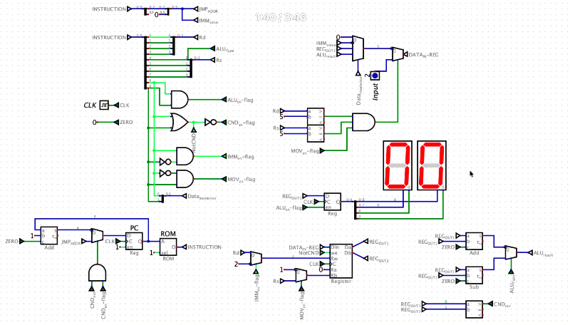

# Minimal 10-bit CPU Design & Embedded Implementation

A custom-designed 10-bit CPU architecture engineered and simulated using the **Digital** logic design tool. This project showcases hardware-software co-design, optimized control units, instruction set expansion, and rigorous low-level assembly debugging to solve practical hardware constraints.

---

## 🛠️ System Architecture Overview

* **Data Path:** Custom 10-bit Instruction Set Architecture (ISA).
* **Word Size:** 8-bit registers and ALU operands.
* **Control Unit:** Custom micro-programmed/combinational control unit modified to support dynamic peripheral parsing.
* **Memory Map:** Harvard Architecture inspired separated Instruction ROM and Data memory.

---

## ✅ Tasks & Implementation Breakdown

### Task I.1: Underflow Protection & ALU Correction
* **Objective:** Read an external stimulus (button input) into a register, subtract a constant threshold ($39_{10}$), and robustly display the output on a 7-Segment display.
* **Engineering Insight:** Handled 8-bit Two's Complement underflow edge cases to guarantee stable physical outputs during negative subtraction boundaries.

### Task I.2: Accumulative Double-and-Add Arithmetic
* **Objective:** Sequential multi-step arithmetic parsing. The program fetches an initial button entry, duplicates its value via ALU addition (`R3 = R0 + R1`), reads a second independent peripheral input, and accumulates them into a final total.
* **Execution Strategy:** Optimized temporary registers to prevent data hazards and arithmetic overwrites before latching the final state onto the display.

### Task I.3 & I.4: Iterative Fibonacci Generation & Overflow Analysis
* **Objective:** Calculate the classic Fibonacci sequence iteratively. Task I.3 computes up to the 5th term, while Task I.4 attempts to loop infinitely ("Fibonacci Forever").
* **The "Hardware Limit" Bug & Discovery:** An architectural analysis reveals that the loop is **not infinite**. Due to the strict 8-bit register layout, an integer overflow triggers at the $13\text{th}$ term ($144 + 233 = 377 \rightarrow 121$ in unsigned 8-bit). 
  * If the comparator behaves as **Unsigned**, the relation $R0 > R1$ ($121 > 233$) evaluates to *False*, instantly breaking the jump loop.
  * If treated as **Signed**, $144_{10}$ turns into $-112_{10}$ via Two's Complement, violating the conditional loop parameter immediately.

### Task I.5: Interactive State Lock ("Wait For Me")
* **Objective:** Initialize the hardware display at `04`. Poll an external input continuously, holding the program counter inside a strict boundary loop until the precise input matches $27_{10}$ ($0x1B$). Upon matching, break the loop, jump to a terminal address, and lock the display on $83_{10}$ (`53` in Hex).
* **Algorithmic Trick:** Since the CPU hardware only implemented a Greater-Than (`>`) comparator, exact equality (`== 27`) was achieved purely in software using a **Double-Boundary Condition Check** (verifying that neither $\text{Input} > 27$ nor $27 > \text{Input}$ is true).

---

## 📊 Live Demos & Simulations

### Task I.4: Fibonacci Sequence Infinite Loop & Overflow Latch
Below is the live execution of the iterative arithmetic sequence running on the 10-bit datapath, showcasing real-time register updates and structural clock cycles:

  

### Task I.5: Conditional Lock ("Wait For Me") Dynamic Verification
Demonstrating real-time peripheral polling, execution of the double-boundary conditional check, and jumping to the terminal safe state upon registering exact match criteria:

  

---

## 📝 Complete Technical Documentation & Memory Maps

### Master ROM Instruction Table (All Laboratory Tasks)

| ROM Addr | Hex Code | My Assembly | Explanation | Assembly To Binary |
| :--- | :--- | :--- | :--- | :--- |
| **[Task I.1]** | | | **Underflow Task Subtraction** | |
| **0x00** | 200 | `MOV R0, R0` | CPU Initialization | `# 1000000000` |
| **0x01** | 255 | `MOV R5, R5` | Read input number from button and store in R5 | `# 1001010101` |
| **0x02** | 250 | `MOV R5, R0` | Move input number to R0 (ALU Input A) | `# 1001010000` |
| **0x03** | 127 | `IMM 39` | Load number 39 (0x27) from ROM into R2 | `# 0100100111` |
| **0x04** | 221 | `MOV R2, R1` | Move number 39 from R2 to R1 (ALU Input B) | `# 1000100001` |
| **0x05** | 313 | `SUB R3` | Execute ALU Subtraction: R3 = R0 - R1 (Input - 39) | `# 1100010011` |
| **0x06** | 230 | `MOV R3, R0` | Move final result to R0 to display on 7-Segment | `# 1000110000` |
| **0x07** | 307 | `ADD R7` | Dummy ALU operation to trigger 7-Segment latch update | `# 1100000111` |
| **[Task I.2]** | | | **Double The Number Then Add** | |
| **0x00** | 200 | `MOV R0, R0` | CPU Initialization | `# 1000000000` |
| **0x01** | 255 | `MOV R5, R5` | Read first input from button and store in R5 | `# 1001010101` |
| **0x02** | 250 | `MOV R5, R0` | Move first input to R0 (ALU Input A) | `# 1001010000` |
| **0x03** | 251 | `MOV R5, R1` | Move first input to R1 (ALU Input B) | `# 1001010001` |
| **0x04** | 303 | `ADD R3` | Double the number: R3 = R0 + R1 | `# 1100000011` |
| **0x05** | 255 | `MOV R5, R5` | Read second input from button and store in R5 | `# 1001010101` |
| **0x06** | 251 | `MOV R5, R1` | Move second input to R1 (ALU Input B) | `# 1001010001` |
| **0x07** | 230 | `MOV R3, R0` | Move the doubled result from R3 to R0 (ALU Input A) | `# 1000110000` |
| **0x08** | 303 | `ADD R3` | Add second input to doubled result: R3 = R0 + R1 | `# 1100000011` |
| **0x09** | 230 | `MOV R3, R0` | Move final total result to R0 to display on 7-Segment | `# 1000110000` |
| **0x0A** | 307 | `ADD R7` | Dummy ALU operation to trigger 7-Segment latch update | `# 1100000111` |
| **[Task I.3]** | | | **Calculate Fibonacci Term 5** | |
| **0x00** | 200 | `MOV R0, R0` | CPU Initialization | `# 1000000000` |
| **0x01** | 101 | `IMM 1` | Load 1st Fibonacci term (1) into R2 | `# 0100000001` |
| **0x02** | 220 | `MOV R2, R0` | Move 1st term to R0 | `# 1000100000` |
| **0x03** | 101 | `IMM 1` | Load 2nd Fibonacci term (1) into R2 | `# 0100000001` |
| **0x04** | 221 | `MOV R2, R1` | Move 2nd term to R1 | `# 1000100001` |
| **0x05** | 303 | `ADD R3` | Calc 3rd term (1+1=2) and store in R3 | `# 1100000011` |
| **0x06** | 210 | `MOV R1, R0` | Shift register: Move 2nd term to R0 | `# 1000010000` |
| **0x07** | 231 | `MOV R3, R1` | Shift register: Move 3rd term to R1 | `# 1000110001` |
| **0x08** | 304 | `ADD R4` | Calc 4th term (1+2=3) and store in R4 | `# 1100000100` |
| **0x09** | 210 | `MOV R1, R0` | Shift register: Move 3rd term to R0 | `# 1000010000` |
| **0x0A** | 241 | `MOV R4, R1` | Shift register: Move 4th term to R1 | `# 1001000001` |
| **0x0B** | 305 | `ADD R5` | Calc 5th term (2+3=5) and store in R5 | `# 1100000101` |
| **0x0C** | 250 | `MOV R5, R0` | Move 5th term to R0 to display on 7-Segment | `# 1001010000` |
| **0x0D** | 307 | `ADD R7` | Dummy ALU operation to trigger 7-Segment latch update | `# 1100000111` |
| **[Task I.4]** | | | **Fibonacci Forever Loop** | |
| **0x00** | 200 | `MOV R0, R0` | CPU Initialization | `# 1000000000` |
| **0x01** | 101 | `IMM 1` | Load 1st Fibonacci term (1) into R2 | `# 0100000001` |
| **0x02** | 221 | `MOV R2, R1` | Move 1st term to R1 (Smaller term init) | `# 1000100001` |
| **0x03** | 101 | `IMM 1` | Load 2nd Fibonacci term (1) into R2 | `# 0100000001` |
| **0x04** | 220 | `MOV R2, R0` | Move 2nd term to R0 (Larger term init) | `# 1000100000` |
| **0x05** | 303 | `ADD R3` | **[Loop Start]** Calc next term: R3 = R0 + R1 | `# 1100000011` |
| **0x06** | 201 | `MOV R0, R1` | Shift: Older larger term becomes the new smaller term (R1) | `# 1000000001` |
| **0x07** | 230 | `MOV R3, R0` | Shift: New sum becomes the new larger term (R0) -> Displays | `# 1000110000` |
| **0x08** | 005 | `CND 0x05` | Jump to PC=0x05 (Condition R0 > R1 is always true) | `# 0000000101` |
| **[Task I.5]** | | | **Conditional State Lock (Wait For Me)** | |
| **0x00** | 104 | `IMM 4` | Load initial target value 4 into R2 | `# 0100000100` |
| **0x01** | 220 | `MOV R2, R0` | Move 4 to R0 for display | `# 1000100000` |
| **0x02** | 307 | `ADD R7` | Trigger 7-seg to display 04 | `# 1100000111` |
| **0x03** | 11B | `IMM 27` | Load target threshold 27 (0x1B) into R2 | `# 0100011011` |
| **0x04** | 255 | `MOV R5, R5` | **[Loop Start]** Read input from button into R5 | `# 1001010101` |
| **0x05** | 221 | `MOV R2, R1` | Move target 27 to R1 (for Condition A check) | `# 1000100001` |
| **0x06** | 250 | `MOV R5, R0` | Move input to R0 (for Condition A check) | `# 1001010000` |
| **0x07** | 004 | `CND 0x04` | Check if Input > 27. If true, jump back to PC=0x04 | `# 0000000100` |
| **0x08** | 251 | `MOV R5, R1` | Move input to R1 (for Condition B check) | `# 1001010001` |
| **0x09** | 220 | `MOV R2, R0` | Move target 27 to R0 (for Condition B check) | `# 1000100000` |
| **0x0A** | 004 | `CND 0x04` | Check if 27 > Input. If true, jump back to PC=0x04 | `# 0000000100` |
| **0x0B** | 153 | `IMM 83` | **[Exit Loop]** Input is exactly 27! Load value 83 (0x53) | `# 0101010011` |
| **0x0C** | 220 | `MOV R2, R0` | Move 83 to R0 | `# 1000100000` |
| **0x0D** | 307 | `ADD R7` | Trigger 7-seg to update and display 53 (hex for 83) | `# 1100000111` |
| **0x0E** | 00E | `CND 0x0E` | Infinite loop: Jump to PC=0x0E (Locks the processor on 83) | `# 0000001110` |

---

## 🚀 How to Run the Simulation
1. Download and install [Digital](https://github.com/hneemann/Digital).
2. Clone this repository to your local machine.
3. Open the main circuit design file (`*.dig`) within the Digital environment.
4. Right-click on the embedded **ROM** component, click *Load*, and import the machine code file (`.hex` or copy directly from the instruction map).
5. Press the **Play** button to initialize the simulation. 
6. Turn on the automatic **Clock Generator** or step through manually to observe live automated register state jumps and indicator display status updates.

*Developed as part of the Computer Architecture & Digital Logic Design Laboratory at Sharif University of Technology.*
